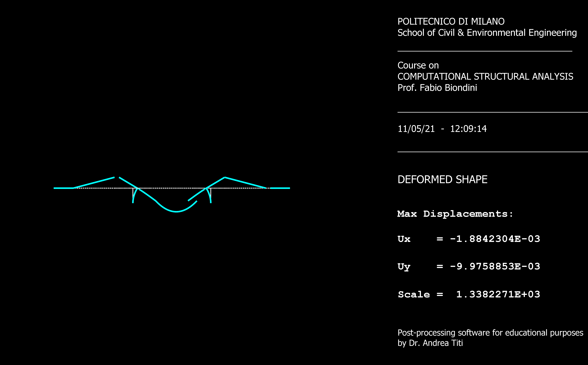
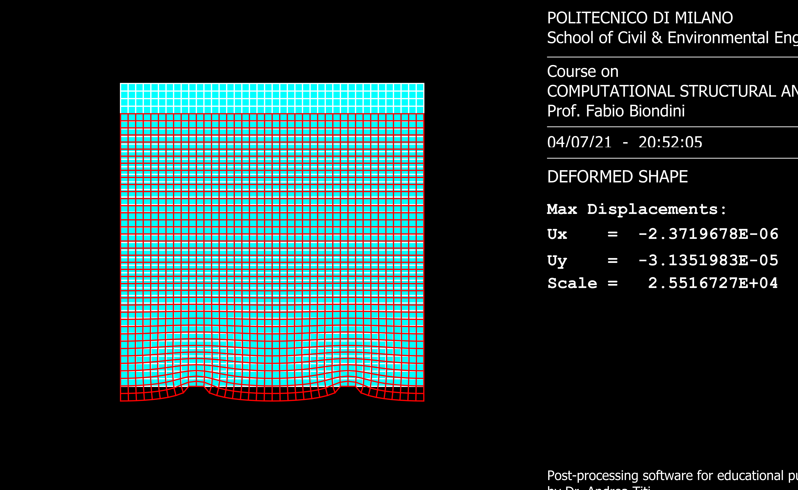
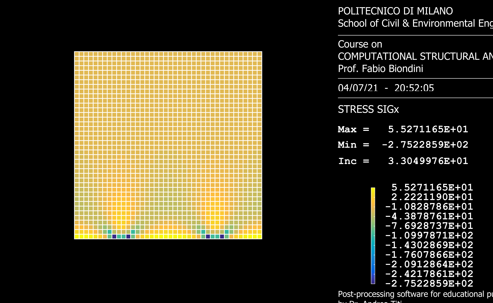

# Computational Structural Analysis

A Fortran 90 finite element analysis package for **2D frame structures** and **isoparametric quadrilateral (ISOP4) continuum elements**, with MATLAB-based visualization.

## Sample Results

### Frame Analysis — Bridge Deformed Shape



*Multi-span bridge structure with roller supports showing the deformed shape (cyan) against the undeformed geometry (white dashed). Max vertical displacement: 9.98 mm.*

### ISOP4 Element Analysis — Mesh Deformation



*1600-element quadrilateral mesh (1681 nodes) showing deformed shape (red) overlaid on the original geometry (cyan) under applied loading.*

### ISOP4 Element Analysis — Stress Contour (SIGx)



*Normal stress distribution (SIGx) across the plate, with color-mapped contours ranging from +55 to -275 kN/m². Stress concentration visible at the bottom support region.*

---

## Modules

### Frame Analysis (`CSA_2021_FRAME/`)

Solves 2D beam/frame problems using Timoshenko beam theory (includes shear deformation). Each node carries 3 degrees of freedom: horizontal displacement, vertical displacement, and rotation.

**Capabilities:**
- Distributed loads (constant and linearly varying)
- Thermal effects (uniform temperature change and gradient)
- Prestressing forces with eccentric cable profiles
- Elastic supports and inter-node links
- Internal hinges and roller releases
- Imposed displacements (absolute and relative)
- Self-weight

### ISOP4 Element Analysis (`CSA_2021_ISOP4/`)

Solves 2D continuum problems using 4-node isoparametric quadrilateral elements with 2 DOF per node. Supports both plane stress and plane strain formulations.

**Capabilities:**
- Automatic rectangular mesh generation with isoparametric mapping
- Gaussian quadrature (1×1 through 4×4 integration)
- Surface traction and body force loads
- Thermal loading
- Principal stress and strain computation
- Nodal stress averaging (arithmetic, volumetric, and energy-weighted)
- Deformation energy analysis per element

### Benchmarks (`CSA_2021_BENCHMARKS/`)

Validation suite with 10+ progressive frame benchmarks (simple beams through multi-span bridge structures) and multiple ISOP4 test cases across four boundary condition sets.

## Analysis Pipeline

```
Input (.txt) → GEOMET → SCODE → LOADS → ASSEMB/MKK → SOLVE → STRESS → PLOT
                 │         │       │         │            │        │
             Read mesh   Set BCs  Apply   Assemble     Gaussian  Compute
             & props    & DOFs   loads    K·d = F      elimin.   forces/stress
```

## Building

The source is compiled with the **NAG Fortran** compiler. Each module includes `.make` and `.mako` build files:

```bash
cd CSA_2021_FRAME
nagfor -o frame.exe frame.f90
```

```bash
cd CSA_2021_ISOP4
nagfor -o isop4.exe isop4.f90
```

## Usage

Both programs read from a structured text input file and write results to an output file:

```bash
./frame.exe < input.txt > output.txt
./isop4.exe < input.txt > output.txt
```

Input files define: node coordinates, material properties, cross-section data, element connectivity, boundary conditions, and applied loads. See the `Case Studies/` directories for examples.

## Output

Results include:
- Nodal displacements (with min/max summary)
- Element internal forces (frame) or stress/strain tensors (ISOP4)
- Principal stresses and directions
- Strain energy and external work balance
- Plot data (`PLOT.DAT`) for visualization via the MATLAB interface

## Tech Stack

| Component | Technology |
|-----------|------------|
| Solver | Fortran 90 |
| Compiler | NAG Fortran (`nagfor`) |
| Visualization | MATLAB |